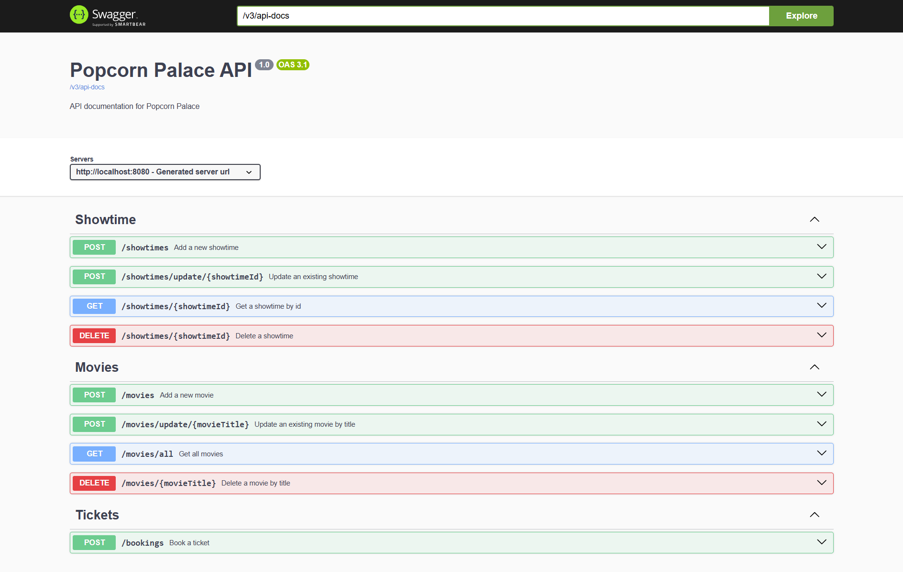

# Instructions

## Prerequisites
- **Java 21** (Recommended and tested)
- Maven 3.6+
- Docker (for PostgreSQL via Docker Compose)

## Setup

1. Clone the repository.
2. Make sure Docker is running.
3. From the project root, start the PostgreSQL container:
   ```bash
   docker compose -f compose.yml up
   ```
4. Build the project using Maven:
   ```bash
   mvn clean install
   ```

## Running the Application

Run the main class to start the application from:

`PopcornPalaceApplication`


Once running, access the API documentation via Swagger:
[http://localhost:8080/swagger-ui/index.html#/](http://localhost:8080/swagger-ui/index.html#/)



---

## Testing

### Unit Tests & Controller Tests
Run all unit and controller tests with:
```bash
mvn test
```

Test classes include:
- `MovieControllerTest`
- `ShowtimeControllerTest`
- `TicketControllerTest`
- `MovieServiceTest`
- `ShowtimeServiceTest`
- `TicketServiceTest`

### Integration Tests
The file `PopcornPalaceApplicationTests.java` contains full CRUD integration flows that simulate real user behavior end-to-end via HTTP using `TestRestTemplate`.

---

## Domain Logic Highlights

### Movie
- Cannot add or update a movie with a **duplicate title**.
- `duration` and `releaseYear` must be **positive numbers**.
- If the movie has active showtimes, the new `duration` **must not exceed** the actual duration of those showtimes.

### Showtime
- **No overlapping showtimes** are allowed in the same theater.
  > Even back-to-back showtimes (e.g., 18:00–19:00 and 19:00–20:00) are considered overlapping due to the shared minute.
- Deleting a showtime will automatically delete all associated tickets.
- Each theater has a default of **200 available seats**, defined in `Configuration.java`, and can be changed there.

### Ticket
- Tickets are uniquely identified using a `UUID` (`bookingId`).
- A ticket can be booked only if:
    - The showtime exists and has available seats.
    - The seat for that showtime is not already booked.
    - The seat number is between `1` and the max allowed seats.

---

## Configuration

- **Database Credentials**: Defined both in `compose.yml` (for Docker PostgreSQL) 
- and in `src/main/resources/application.properties` (application-side configuration).

- **Available Seats per Theater**: Change in `Configuration.java`:
  ```java
  public static final int numberOfSeats = 200;
  ```

---

